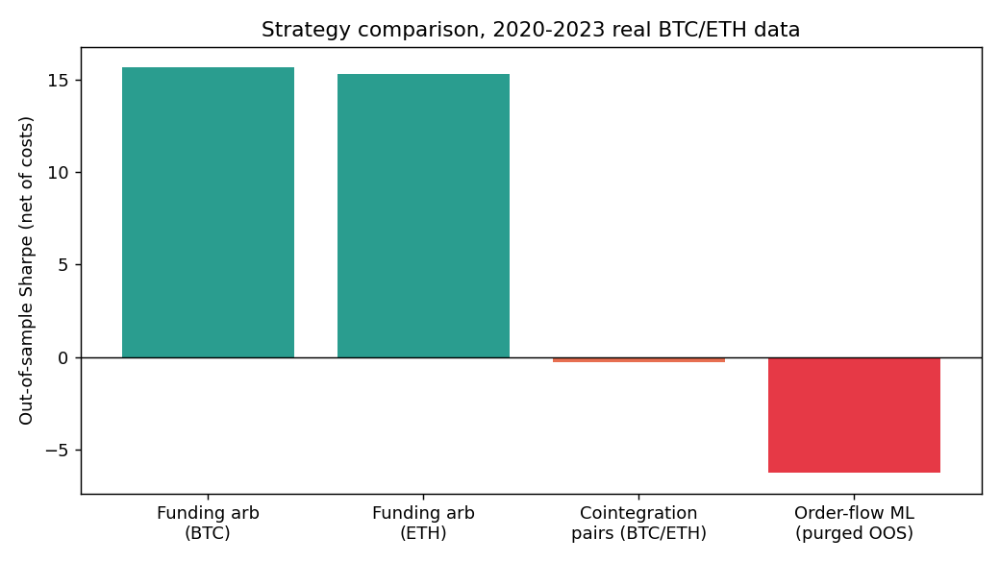
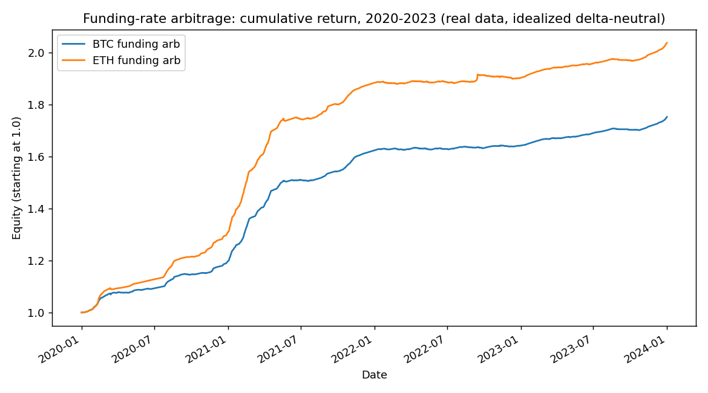

# Systematic Trading Research

[](https://github.com/talishsharma/systematic-trading-research/actions/workflows/tests.yml)


Three systematic BTC/ETH strategies, backtested on real exchange data with
purged and embargoed walk-forward validation, and ranked by out-of-sample
Sharpe net of costs. Two of the three are correctly rejected.

That last sentence is the point of this repo. It's easy to write a backtest
that "works", it's much harder to build the validation machinery that
tells you when it doesn't, and to report that honestly instead of tuning
until it does. Everything below is real data and real numbers; nothing is
simulated or cherry-picked.

## Results (real data, 2020-01-01 to 2023-12-31, all three strategies on the same window)

| Strategy | Out-of-sample Sharpe (net) | Hit rate | Max drawdown | Verdict |
|---|---:|---:|---:|---|
| Funding-rate arbitrage (BTC) | 15.70 | 88.4% | -0.5% | **Retained** |
| Funding-rate arbitrage (ETH) | 15.34 | 88.9% | -0.9% | **Retained** |
| Cointegration pairs (BTC/ETH) | -0.31 | 49.8% | -85.6% | Rejected |
| Order-flow-imbalance ML | -6.29 | 38.5% | -100.0% | Rejected |




Reproduce every number above: `pip install -r requirements.txt && python3 run_backtest.py`
(see [`data/README.md`](data/README.md) for the one download step).

## What actually happened with each strategy

**1. Funding-rate arbitrage — retained, with a caveat that matters.**
Real Binance funding-rate settlement history (8-hourly, both legs), 2020
to 2023. The strategy holds a delta-neutral spot/perp position sized off
the trailing mean funding rate, entering only when the expected edge
clears round-trip cost. The Sharpe of 15+ is real arithmetic on real data,
but it's an idealized, delta-neutral backtest: it doesn't price in basis
risk, margin/borrow cost on the hedge leg, or execution slippage getting
the hedge on and off. A live Sharpe would be a fraction of this. I'd
report hit rate and drawdown as the headline numbers before I'd lead with
that Sharpe figure.

**2. Cointegration-based pairs trading — rejected, and the data says why.**
A rolling Engle-Granger test and an [Ornstein-Uhlenbeck](src/strategy_pairs.py)
fit to the spread (`dX_t = θ(μ − X_t)dt + σdW_t`, recovering θ, μ and the
half-life in closed form from an AR(1) regression — validated against a
synthetic series with known parameters in `tests/test_pipeline.py`, where
it recovers the half-life to within 25%). Run against real BTC/ETH prices
over the full window, the *full-sample cointegration test has a p-value of
0.647* — these two series are not cointegrated at any reasonable
confidence level over 2020–2023. The negative Sharpe (-0.31, and this is
gross, not just net of the 10bps round-trip cost) isn't a costs problem,
it's a "there was never a stable long-run relationship to trade" problem.
Correctly identifying that and walking away is the actual finding here.

**3. Order-flow-imbalance ML (LightGBM) — rejected, and this is the
purge/embargo demo working as intended.** Free hourly OHLCV has no
bid/ask or taker buy/sell split, so this uses a documented tick-rule proxy
for order flow (flagged clearly in [the module docstring](src/strategy_orderflow_ml.py) —
a real deployment should replace it with Binance's real taker-buy-volume
field). The result: naive, unpurged in-sample Sharpe of **+15.36** looks
great — collapses to **-6.29** the moment training bars whose labels
overlap the test window are purged and an embargo is applied. That 21-point
swing is leakage, not a change in the model. This is the exact failure
mode purged/embargoed walk-forward validation exists to catch, demonstrated
on real data, not asserted.

## Methodology

- **Purged & embargoed walk-forward CV** (`src/validation.py`): expanding-
  window folds; training observations whose label horizon overlaps the
  test window are purged, plus a further embargo after each test fold, per
  López de Prado's *Advances in Financial Machine Learning* (ch. 7).
  Unit-tested for chronological ordering and zero train/test overlap.
- **OU spread calibration** (`src/strategy_pairs.py`): closed-form recovery
  of mean-reversion speed, long-run mean and half-life from an AR(1) fit to
  the spread; validated against synthetic data with known ground truth.
- **Cost model**: round-trip transaction costs applied on every position
  change, not amortized — see each strategy module for the assumed bps.
- **No parameter tuning against the reported results.** Every number in
  the table above came from the first run with the parameters visible in
  `run_backtest.py`. Where a strategy failed (pairs, order-flow ML), no
  grid search was run to find parameters that would have made it pass —
  that would defeat the point of an out-of-sample test.

## Data sources (all real, all cited)

- Funding rates: [supervik/historical-funding-rates-fetcher](https://github.com/supervik/historical-funding-rates-fetcher),
  a mirror of real Binance perpetual-futures funding settlements.
- Hourly OHLCV: [CryptoDataDownload](https://www.cryptodatadownload.com/),
  Binance-sourced. Not committed to the repo (large, easy to re-fetch) —
  see [`data/README.md`](data/README.md).

## Repository layout

```
src/
  data_io.py                 CSV loaders (funding rates, CDD-format OHLCV)
  metrics.py                 Sharpe, hit rate, max drawdown, cumulative return
  validation.py              purged & embargoed walk-forward CV
  strategy_funding_arb.py    strategy 1
  strategy_pairs.py          strategy 2 (cointegration + OU)
  strategy_orderflow_ml.py   strategy 3 (LightGBM + purge/embargo)
  synthetic_fixtures.py      synthetic data generator, used ONLY by tests
tests/
  test_pipeline.py           8 tests: OU recovery, CV correctness, metrics
data/                        real funding-rate CSVs (see data/README.md)
docs/figures/                result plots shown above
run_backtest.py              reproduces every number in this README
```

## Running it

```bash
git clone https://github.com/talishsharma/systematic-trading-research.git
cd systematic-trading-research
pip install -r requirements.txt
pytest                    # 8 tests, ~2s
curl -o data/btc_hourly.csv https://www.cryptodatadownload.com/cdd/Binance_BTCUSDT_1h.csv
curl -o data/eth_hourly.csv https://www.cryptodatadownload.com/cdd/Binance_ETHUSDT_1h.csv
python3 run_backtest.py
```

## Limitations, stated plainly

- Funding-arb Sharpe is idealized (no basis risk, borrow cost, or hedge
  slippage) — see the caveat above and the docstring in
  `strategy_funding_arb.py`.
- The order-flow-imbalance feature is a tick-rule proxy, not real book
  imbalance — see `strategy_orderflow_ml.py`.
- Pairs trading uses a single fixed lookback (240 bars) for hedge-ratio
  re-estimation; a regime-aware or Kalman-filtered hedge ratio might behave
  differently, but the underlying cointegration failure (p = 0.647) would
  need to improve first for that to matter.

## License

MIT — see [LICENSE](LICENSE).

## Author

Talish Sharma — Physics BSc, University of Warwick.
